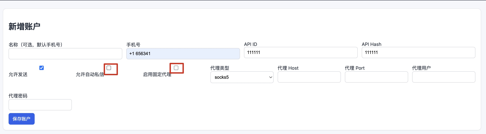
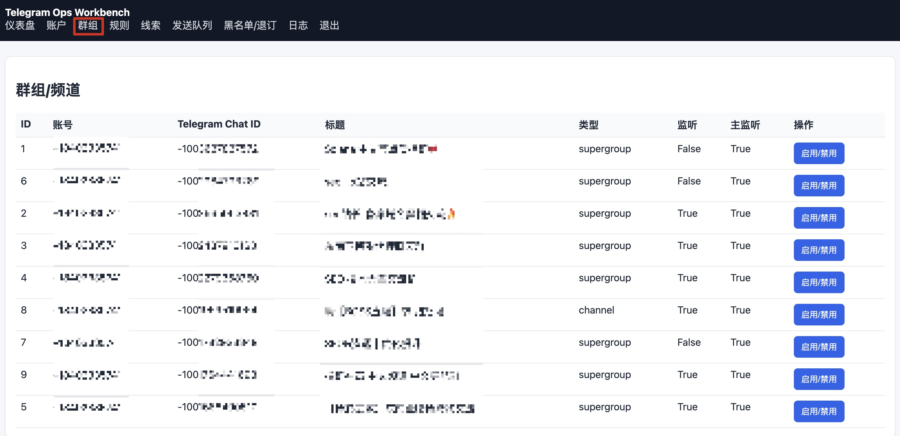

# telegram-ops

[](https://github.com/kevenlemon/telegram-ops/actions/workflows/ci.yml)
[](./LICENSE)

Open-source Telegram operations console for message monitoring, keyword matching, queue-based follow-up, and review-friendly automation.

`telegram-ops` is built with `FastAPI`, `Telethon`, `SQLAlchemy`, and a lightweight web UI. It is designed for teams that need a self-hosted control panel to manage multiple Telegram accounts, sync chats, watch public conversations, archive matched messages, and handle rule-driven responses with clear guardrails.

## 中文简介

`telegram-ops` 是一个自托管的 Telegram 运维面板，适合做消息监听、规则匹配、命中归档、审核辅助和有限自动化响应。它尽量把多账号管理、聊天同步、规则配置、发送队列和日志审计放到一个轻量的 Web 界面里，方便部署和日常运营。

## Why this project

- Multi-account Telegram session management from a single web console
- Real-time keyword or regex matching across synced chats
- Structured lead archiving and send queue tracking
- Per-account proxy support for segmented network routing
- Guard records for blocked or unsubscribed users
- Self-hosted deployment with a small Python stack

## Typical use cases

- Community operations: monitor support or community groups for repeated help requests and route them to a review queue
- OSINT and research: archive messages that match security, fraud, or incident keywords for later analysis
- Internal operations: watch designated Telegram channels for alerts, escalations, or incident signals

## Feature overview

### Account and chat management

- Add multiple Telegram accounts from the web interface
- Send login codes and complete account verification in the panel
- Sync chats per account and selectively enable or disable listeners
- Start or stop background workers from the dashboard

### Rule engine

- Match by keyword or regex
- Scope rules by account or chat
- Support record-only, group reply, private message, or both send modes
- Render reply templates with Jinja-style variables such as `{{ username }}` and `{{ rule_name }}`

### Operations and auditing

- Store matched messages in SQLite
- Track queued sends and delivery logs
- Apply cooldowns and per-account or per-user daily limits
- Maintain guard records for blacklisted or unsubscribed users

## Screenshots

The existing operation screenshots are kept here for fast onboarding.

1. Add account details, API credentials, proxy settings, and send permissions.


2. Send the login code, then complete verification after Telegram returns the code or password challenge.


3. Review synced chats and enable only the groups or channels you want to monitor.


4. Create keyword or regex rules and choose whether matches should be archived only or queued for replies.


## Quick start

### Option 1: Docker Compose

1. Clone the repository.
2. If `telegram-ops/.env` does not exist yet, copy `telegram-ops/.env.example` to `telegram-ops/.env`.
3. Review `telegram-ops/.env` and update `APP_SECRET_KEY`.
4. If you prefer a hashed admin password, run:

```bash
python3 ./telegram-ops/scripts/hash_password.py
```

5. Put the generated hash into `ADMIN_PASSWORD_HASH` and clear `ADMIN_PASSWORD`.
6. Start the stack:

```bash
docker-compose up -d
```

### Option 2: Local development

```bash
cd telegram-ops
python3 -m venv .venv
source .venv/bin/activate
pip install -r requirements.txt
uvicorn app.main:app --reload
```

## Configuration

The app reads environment variables from `telegram-ops/.env`.
A fresh deployment can start by copying `telegram-ops/.env.example` to `telegram-ops/.env`, then editing the values for the target environment.

Important settings:

- `APP_SECRET_KEY`: session signing secret, change this before deployment
- `DATABASE_URL`: SQLite by default, can be replaced with another SQLAlchemy-compatible database URL
- `ADMIN_USERNAME`: admin login name
- `ADMIN_PASSWORD` or `ADMIN_PASSWORD_HASH`: choose one, hashed password is recommended
- `ADMIN_ALLOWED_IPS`: optional IP allowlist, supports comma-separated IPs or CIDR ranges
- `AUTO_START_TELEGRAM_WORKERS`: whether background listeners should start with the app

A sample config is available in `telegram-ops/.env.example`.

## Responsible use

- Use this project only in environments where you are permitted to monitor, archive, or respond to messages
- Review Telegram platform policies, local laws, and your organization's compliance requirements before enabling automated responses
- Prefer `record_only` mode first, then enable send actions only after validating the workflow
- Keep message templates, rate limits, and user guard lists under human review

## Security notes

- Use a strong `APP_SECRET_KEY`
- Prefer `ADMIN_PASSWORD_HASH` over plain-text admin passwords
- Put the panel behind HTTPS when exposed on the internet
- Restrict management access with `ADMIN_ALLOWED_IPS`
- Do not commit real secrets, session files, or live databases

More guidance is available in [docs/security.md](./docs/security.md).

## Documentation

- [Project overview](./docs/overview.md)
- [Architecture notes](./docs/architecture.md)
- [Use cases](./docs/use-cases.md)
- [Security guidance](./docs/security.md)

## Development

```bash
cd telegram-ops
pytest
```

GitHub Actions runs the test suite on every push and pull request.

## Roadmap

- Better chat and account scoping controls for rules
- Export options for leads and logs
- More deployment examples
- Broader test coverage for worker and queue behavior

## Contributing

Issues and pull requests are welcome. Please read [CONTRIBUTING.md](./CONTRIBUTING.md) before opening large changes.

## License

This project is released under the [MIT License](./LICENSE).
